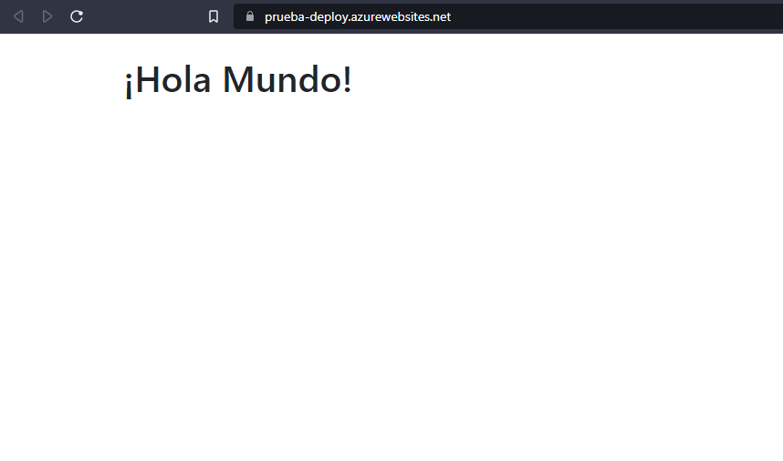

_Que se dice socio_
---
**Que se dice socio**
---
**_Que se dice socio_**
---
~~Tachado~~
---
### eo socio
---
[portafolio](https://portafolioyoiner.azurewebsites.net)
---

---
1. yoiner
1. duran
1. rios
---
* yoiner
* duran 
* rios
---
- yoiner
- duran
- rios
---
1. yoiner
    1. duran
    1. re pro
        1. rios pro
---
- eo
- siu
    - yoiner
    - duran
    - rios
        - alejandra
        - fajardo
---
> cita en linea

> cita
> en
> bloque
>
> re pro
---
|nombre|apellido|numero|
|---|---|---|
|yoiner|duran|3148713538|
|yoiner|duran|3148713538|
|yoiner|duran|3148713538|
---
```js
function suma(a,b){
  return a+b;
}
```
`console.log("hola mundo")`
# fin
```py
def sumar(a+b):
  return a+b
```
---
```cpp
#include <iostream>

int suma(int numero1, int numero2) {
    return numero1 + numero2;
}

int main() {
    int num1 = 5;
    int num2 = 7;
    int resultado = suma(num1, num2);

    std::cout << "La suma de " << num1 << " y " << num2 << " es: " << resultado << std::endl;

    return 0;
```
---
```html
<h1>Holi</h1>
<p>Re pro</p>
```
---
<!-- Esto es un comentario
sdadad -->
---
**negrita**
\*\*negrita - mostrar codigo\*\*

\_cursiva\_

\# encabezado